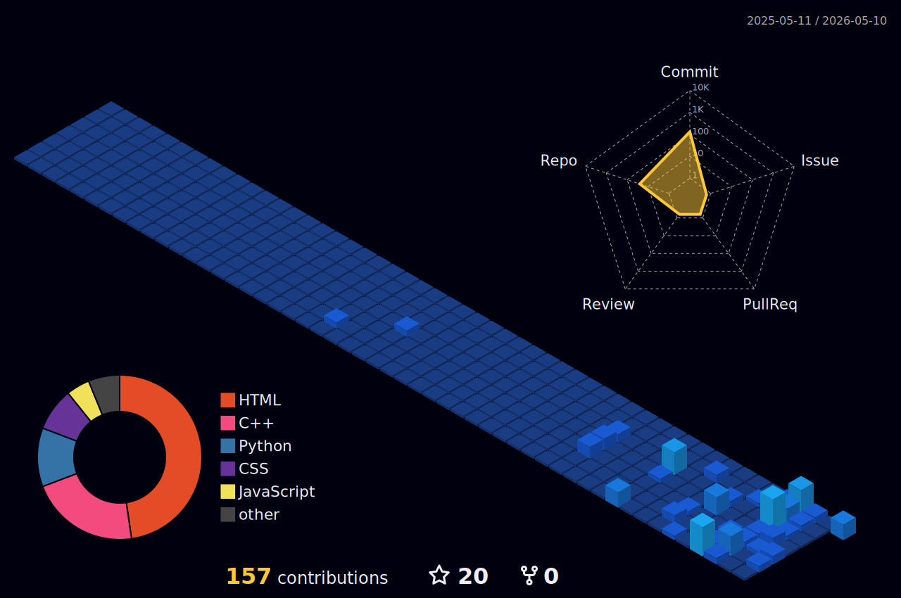

<div align="center">

<!-- ═══════════════════════ HEADER BANNER ═══════════════════════ -->


<!-- ═══════════════════════ TYPING ANIMATION ═══════════════════════ -->

<a href="https://git.io/typing-svg">
  
</a>

<br/>

<!-- ═══════════════════════ SOCIAL BADGES ═══════════════════════ -->

[](https://vansh7266.github.io) 
[](https://linkedin.com/in/vansh7266)
[](mailto:vanshgupta7266@gmail.com)

<br/>


</div>

<br/>

<!-- ═══════════════════════ ABOUT ME (STATE VECTOR) ═══════════════════════ -->

## ⊢ System Initialization : `profile.config`

```json
{
  "developer": "Vansh Gupta",
  "architecture": ["AI/ML", "Agentic Systems", "Mathematical Modeling"],
  "compute_node": "B.Tech IT @ IIIT Bhopal (CGPA: 8.62/10)",
  "current_process": "ML Intern @ Moleculyst [Video LLMs & Multimodal]",
  "optimization_function": "Maximize reasoning visibility, minimize hallucinations",
  "core_competencies": [
    "Large Language & Vision Models (LLMs/VLMs)",
    "Retrieval-Augmented Generation (RAG) & Fine-tuning",
    "Agentic Control Flows (LangChain/LangGraph)",
    "Mathematical Interpretability (SHAP)"
  ]
}
```

<br/>

<!-- ═══════════════════════ TECH STACK ═══════════════════════ -->

## ⚙️ Technical Arsenal

<table>
<tr>
<td valign="top" width="25%">

### 🔤 Syntax
<div align="center">
<br/>

</div>

</td>
<td valign="top" width="25%">

### 🧠 Tensors & ML
<div align="center">
<br/>


</div>

</td>
<td valign="top" width="25%">

### 🤖 Agents & GenAI
<div align="center">


</div>

</td>
<td valign="top" width="25%">

### 🚀 Production
<div align="center">

</div>

</td>
</tr>
</table>

<br/>

<!-- ═══════════════════════ FEATURED SYSTEMS ═══════════════════════ -->

## 🔬 High-Dimensional Systems

<div align="center">

<table>
<tr>
<td width="50%">

### [Moleculyst Studio](https://github.com/vansh7266/agent-crop)
**Agentic AI Image Editing Pipeline**

Ground-first local inpainting with VLM grounding, context-aware cropping, Gemini editing & Laplacian pyramid blending.

`Python` `Gemini` `VLMs` `OpenCV` `Florence-2`

<sub>∇ VLM grounding · Laplacian blending</sub>

</td>
<td width="50%">

### [Equitas AI](https://github.com/vansh7266/google-solution-challenge-2026)
**Autonomous Bias Detection**

5-agent LangGraph pipeline: profile → detect → remediate → explain (SHAP) → audit report.

`Gemini` `LangGraph` `FastAPI` `SHAP` `AIF360`

<sub>∇ 5 agents · 5 metrics · Model card gen</sub>

</td>
</tr>
<tr>
<td width="50%">

### [TriageAI](https://github.com/vansh7266/email_triage_env)
**Email Triage RL Environment**

OpenEnv-compatible RL env for categorizing & routing support emails with structured rewards.

`Python` `FastAPI` `Pydantic` `OpenEnv` `LLaMA`

<sub>∇ 0.71 avg score · 3 levels · OpenEnv Finalist</sub>

</td>
<td width="50%">

### [PharmAI](https://github.com/vansh7266/pharmai)
**AI Manufacturing Intelligence**

Batch quality prediction, anomaly detection, energy forecasting & SHAP-backed alerts.

`XGBoost` `Random Forest` `LSTM` `TensorFlow`

<sub>∇ >90% acc · 4 AI models · 8 phases</sub>

</td>
</tr>
</table>

</div>

<details>
<summary><b>📂 Expand for More Shipped Work</b></summary>
<br/>

| Project | Description | Stack |
|:--------|:-----------|:-----|
| 🧪 [**ToxPredict**](https://github.com/vansh7266/toxpredict) | Predicts toxicity across Tox21 targets from SMILES using GNNs. | `PyTorch Geometric` `XGBoost` `RDKit` |
| 🏟️ [**StadiumPulse**](https://github.com/vansh7266/Google-PromptWar-1.1) | Context-aware Gemini assistant with live queue simulation & crowd density. | `Gemini` `Express` `Google Maps` |
| 🏷️ [**AuctionX**](https://github.com/vansh7266/auctionx) | Real-time auction platform — proxy auto-bidding, dual dashboards. | `Firebase` `JavaScript` `Firestore` |
| ❤️ [**CardioAI**](https://github.com/vansh7266/CardioAI) | Heart disease risk predictor — FastAPI + KNN, 86.96% accuracy. | `FastAPI` `Scikit-learn` `KNN` |
| 🗳️ [**VoteIndiaSmart**](https://github.com/vansh7266/Google-PromptWar-2) | Gemini election education assistant — multilingual, rate-limited. | `FastAPI` `Vertex AI` `Gemini` |
| 🧮 [**CP Archive**](https://github.com/vansh7266/My-Codeforces-Solutions) | Competitive programming — algorithms & math logic. | `C++` `Algorithms` `Math` |

</details>

<br/>

<!-- ═══════════════════════ ACHIEVEMENTS ═══════════════════════ -->

## 🏆 Proof of Execution

<div align="center">

| Signal | Milestone | Metric |
|:--:|:-----------|:-------|
| 🥇 | **JEE Main 2024** | Top 1% (98.16%ile) & JEE Advanced qualified |
| 🏅 | **SRMC Finals** | AIR 27 (IIT Bombay & IIT Madras competition) |
| 🔥 | **Meta × PyTorch OpenEnv** | Grand Finale, Bangalore (Top tier out of 52k+) |
| 🥇 | **CodeBidz Hackathon** | 1st Position (AuctionX Platform) |
| ⭐ | **CodeChef** | 2 Star competitive programming rating |

</div>

<br/>

<!-- ═══════════════════════ THE DAILY IQ TENSOR ═══════════════════════ -->

## 🧩 The Daily IQ Tensor

Let's see if your reasoning engine is fully optimized. 

**Problem:** A neural pipeline has 3 dense hidden layers with $x, y,$ and $z$ parameters (in millions) respectively. You inspect the architecture and find that:
1. $x + y + z = 14$
2. $x^2 + y^2 + z^2 = 84$
3. The network acts as a strict bottleneck: $x > y > z$ (and all are positive integers).

**Question:** What is the value of $z$ (parameters in the final hidden layer)?

<details>
<summary><b>🧠 Think you solved it? Click here to verify your tensor output!</b></summary>
<br/>

If you have the answer, **[Add your name to the Verified Solvers Registry](https://github.com/vansh7266/vansh7266/issues/new?title=I+solved+the+Neural+Tensor+Puzzle!&body=My+answer+for+z+is:+[YOUR+ANSWER+HERE]%0A%0A---%0A*Leave+this+issue+open+so+others+can+see+your+name+in+the+Solvers+list!*)**!

*Current Mathematical Minds:* [](https://github.com/vansh7266/vansh7266/issues)  
*(This badge dynamically tracks the number of submitted solutions!)*
</details>

<br/>

<!-- ═══════════════════════ GITHUB STATS & 3D TENSOR ═══════════════════════ -->

## 📊 Analytics & Contribution Tensor

<div align="center">


&nbsp;&nbsp;


<br/><br/>


<br/><br/>

*(3D Isometric Contribution Matrix — Auto-generates daily via Actions)*


</div>

<br/>

<!-- ═══════════════════════ FOOTER ═══════════════════════ -->

<div align="center">


<br/>

**Always open to building serious AI systems with strong mathematical foundations.**

<br/>

<sub>⚡ `system.exit(0)`</sub>

</div>
